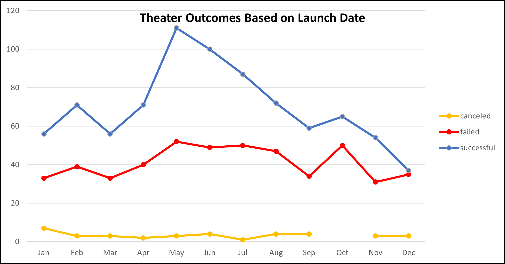
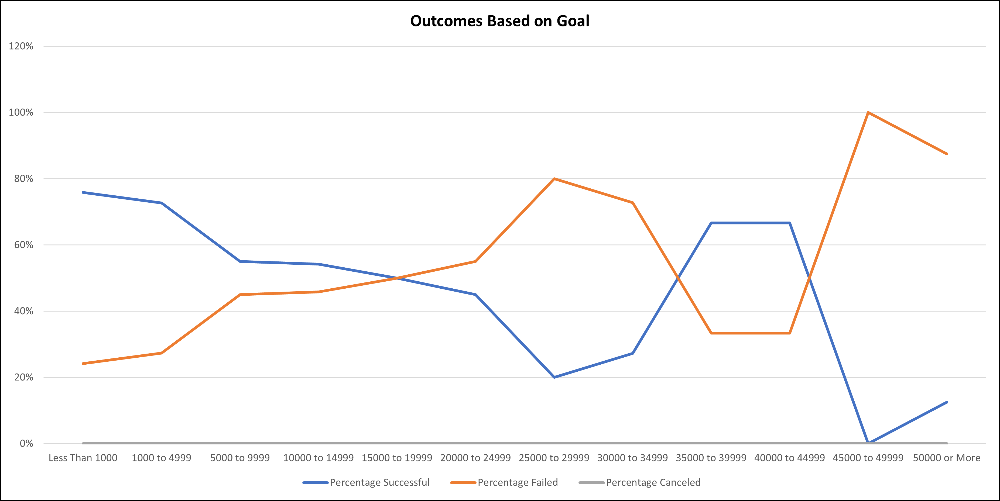

# kickstarter-analysis
## Overiew of Project
+ This project was to show the user how to use excel pivot tables and pivot charts. Additionally, we focused on using statistics to show outcomes for different variables.
## Purpose
+  The reason for aggregating the data in this challenge is to show different trends and outcomes of various outcomes of campaigns. 
## Analysis and Challenges
+ The analysis we put together was showing different theater outcomes based on a launch date over a time series of different data. Additionally, we analyzed the percentages of successful and failed outcomes based on a defined goal range. I didn't find any challenges while putting this data set together.
## Potential Challenge 
+ Potential challenges that can be found is that the data is not showing trends by year, but only by month. To better understand the data, potentially including each year maybe helpful. 
## Analysis of Outcomes Based on Launch Date
+ The outcomes of theaters released in launched in May have a higher success rate than other months. The decline rate of successful theaters in Jun through Sept seem to represent a consistent decline, which could be seasonal. 

## Analysis of Outcomes Based on Goals 
+ The success rate for smaller based goals plays tend to be higher than higher based goal plays. Additionally, those that failed seem to be placed in the 20k to 35k range. 

### Challenges and Difficulties Encountered
+ This data could have some seasonal trends that we aren't seeing the visuals. Furthermore, more detailed data could help solve any of these challenges. 
## Results

- What are two conclusions you can draw about the Outcomes based on Launch Date?
    + Opening theaters in Apr through Jul have the highest success rate. 
    + Theaters launched in colder months, Aug through Mar have much lower success rates. 
- What can you conclude about the Outcomes based on Goals?
    + Goals below $20k have a higher success than other goals. 
    + Goals that are above $25k seem to have a tough time seeing a success rate above 50%
- What are some limitations of this dataset?   
    + The data could be easily influenced by a seaonal trend, which could change the viewers opinion 
    + Outcomes based on goal is only focused on one country. We could introduce a global variable to see if we see anything different. 
- What are some other possible tables and/or graphs that we could create?
    + A scatter plot and bar could be used for the outcomes based on goal chart. 